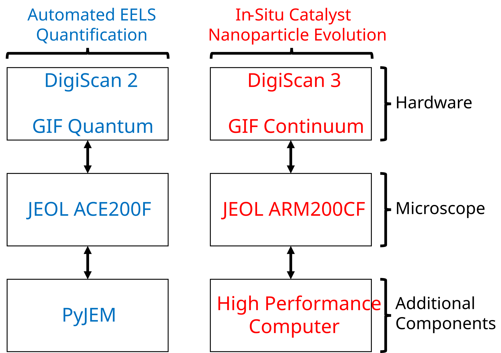
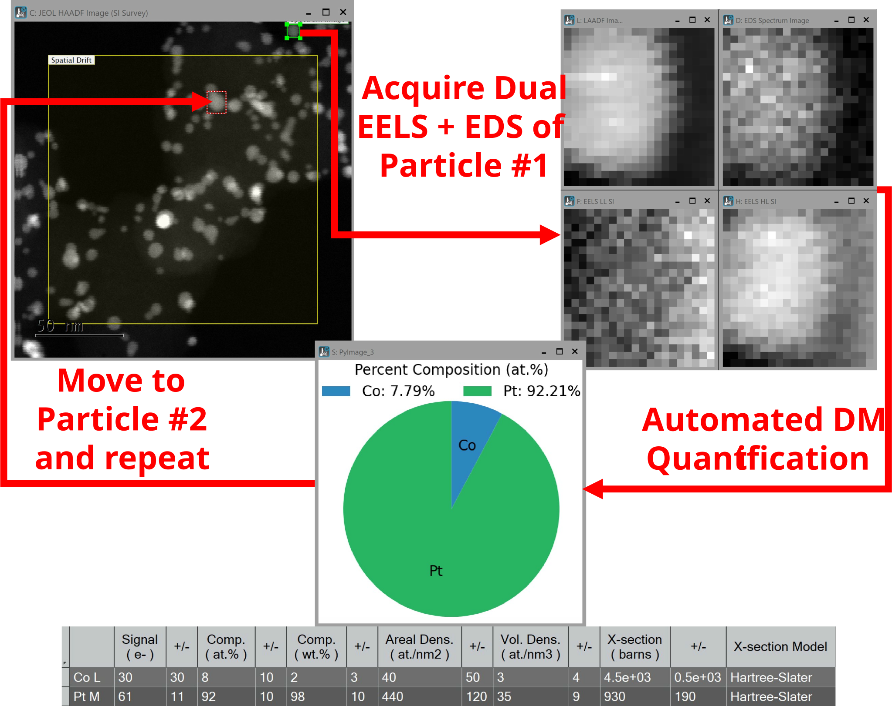

# Autonomous STEM-SI acquisition for catalyst nanoparticle analysis 

This repository contains a Hybrid DigitalMicrograph/Python workflow for automated nanoparticle detection, targeted spectrum imaging (SI), and particle-size analysis. This was demonstrated on nanoparticles, however can be adapted to different features of interest.

Paper: https://technology.matthey.com/content/journals/10.1595/205651327X17690997608791

Citation:
Najeeb, Z., Spillane, L., Schuster, M.E., Varambhia, A. and Ozkaya, D. (2026) 'Autonomous Data Acquisition Pipeline for High Throughput Statistical Analysis of Catalyst Nanoparticles at Elevated Temperature', *Johnson Matthey Technology Review*, 70(4), e70405. doi: 10.1595/205651327X17690997608791.

## Overview

This project implements the automation framework described in the paper for high-throughput STEM analysis of Pt-Co catalyst nanoparticles with in-situ heating control. The workflow combines HAADF survey imaging, automated particle identification, targeted mask-based spectroscopy, and custom scan patterns to reduce dead space and manual intervention.

## Key workflow elements

- HAADF survey imaging for particle detection
- U-Net or threshold-based segmentation for locating nanoparticles
- custom bounding boxes and scan masks around particles
- serpentine scan ordering to minimise flyback time
- targeted SI acquisition around each particle
- particle-size and compositional analysis in the microscope workflow via DigitalMicrographs quantification API

## Architecture and workflow figures

### Figure 1, Overview of automated SI acquisition workflows

This figure gives an overview of automated SI acquisition workflows implemented in the DigitalMicrograph® software: (a) the components used for automated EELS quantification; (b) the components for in situ catalyst nanoparticle evolution. The additional components are used for better performance or additional features. Communication is done via socket-server connections. Note that the in situ workflow can include all the features of the automated EELS workflow.

### Figure 2, Automated EELS and EDS acquisition and analysis per nanoparticle

This workflow shows automated EELS and EDS acquisition and analysis per nanoparticle. Quantification is completed using the internal model-fitting and quantification methods in the DigitalMicrograph® software, given that the elements present have been defined in advance. Once completed for a given field of view, the stage is moved, autofocused and the process is then repeated.

### Figure 3, Automated particle sizing at varying holder temperatures

This figure outlines the in situ workflow: automated particle sizing of platinum-cobalt nanoparticles at varying holder temperatures with dose-efficient custom scan patterns. (a) An image is acquired which is then sent to: (b) a HPC where a U-Net identifies particles and returns the resulting mask; (c) EELS SI data in DualEELS™ mode and ADF images are acquired for each nanoparticle with drift correction, where the beam only scans pixels containing the nanoparticles as defined by the U-Net mask. Once completed for each nanoparticle in the current image, the temperature is increased and the process repeats, where: (d)–(f) nanoparticle sizing is conducted at each temperature step.

## Repository contents

This folder contains the project files currently present in the GitHub repository:

- `2DArray_PSD.py` — particle sizing and scan-generation workflow
- `SI_Auto2DArray.s` — DigitalMicrograph automation script
- `LICENSE` — repository license file

## Requirements

- GMS / DigitalMicrograph
- GMS Python environment with NumPy, SciPy, scikit-image, OpenCV, and Matplotlib
- Optional PyJEM integration for microscope control
- Optional GPU-enabled segmentation host for U-Net inference

When the code is ran, it requires the working directory to include the '2DArray_PSD.py' file.
The code assumes a minimum version of GMS 3.6X to function.

## Usage

1. Check the `SI_Auto2DArray.s` User Global Parameters, setting the appropriate dwell time, number of frames, and the signal to capture alongside SI (e.g. HAADF). Set `DO_CUSTOM_SCAN` and `DO_QUANTIFICATION` as appropriate. If `DO_QUANTIFICATION` is set, state the name of the quantification profile to use (generate this via the quantification tab in the STEM SI technique, where you select the elements and save the profile under a name).

2. Go to the main function at the bottom of `SI_Auto2DArray.s` and comment out the method of acquisition. By default, one area will be scanned according to the threshold method. Version 2 contains a loop for a temperature ramp, communicating with a DENSsolutions Climate holder via the plugin. Version 3 will move the stage in a serpentine path.

3. View the `2DArray_PSD.py` file, where the User Global Parameters define the method of segmentation.

4. In DigitalMicrograph, once you have tuned your EELS and EDS configuration for the acquisition of interest (e.g. set DualEELS energy, view times, and desired dispersions), run the `SI_Auto2DArray.s` script. It will then request you to select an output folder. This output folder should contain the `2DArray_PSD.py` file. The script will then create the necessary persistent tags and scan coordinates, iterating through the found regions based on the threshold mask.

## Scientific scope

The work is focused on platinum-cobalt nanoparticles on carbon supports, with application to catalyst characterisation and structure-property analysis. The broader aim is to enable automated, statistically meaningful STEM datasets under conditions closer to industrially relevant operation. This work is extended with 4D-STEM and a web-based GUI in a different repo (posted shortly)

## References

- Najeeb, Z., Spillane, L., Schuster, M.E., Varambhia, A. and Ozkaya, D. (2026) 'Autonomous Data Acquisition Pipeline for High Throughput Statistical Analysis of Catalyst Nanoparticles at Elevated Temperature', *Johnson Matthey Technology Review*, 70(4), e70405. doi: 10.1595/205651327X17690997608791.

